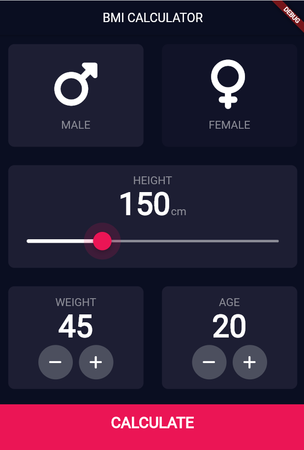
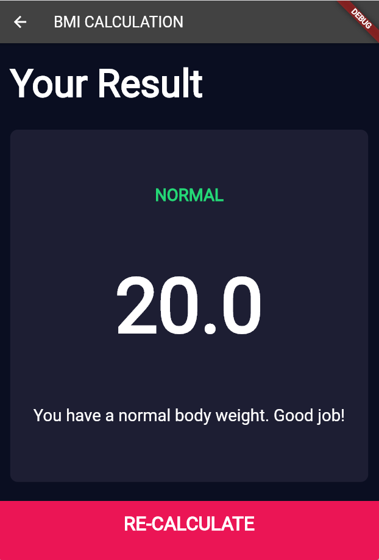
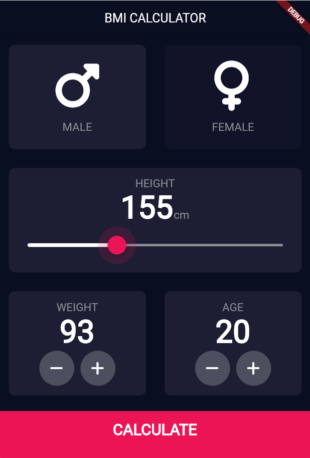

# BMI Calculator

> This is the application where you can calculate your BMI (Body mass index) according to your height and weight.

> If your BMI is:

- below 18.5 – you're in the underweight range
- between 18.5 and 24.9 – you're in the healthy weight range
- between 25 and 29.9 – you're in the overweight range
- 30 or over – you're in the obese range

 
 

